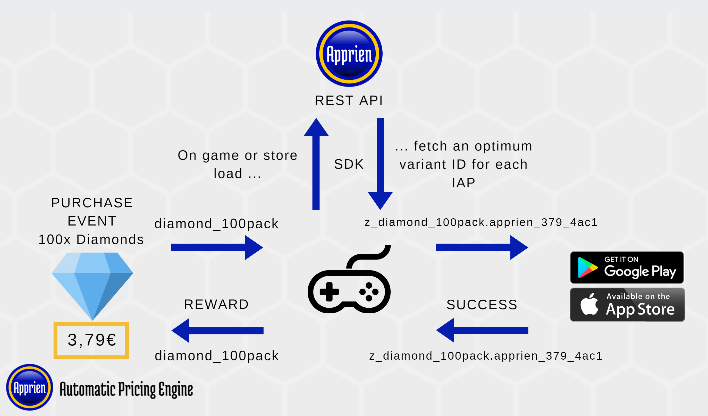

# ApprienObjectiveC

Apprien c++ port to objective-C(WIP). The project will contain more information in the future and an example project that can be used as an example to get quickly started.

Apprien Objective-C sdk is a lightweight client for Apprien Automatic Pricing API for game companies using Objective-c or Swift like environments. Apprien increases your In-App Purchases revenue by 20-40% by optimizing the prices by country, time of the day and customer segment.

It typically takes 0.5-4h to integrate Apprien Objective-C SDK with your game.

The minimal compiled footprint of Objective-C SDK is TBD.

`ApprienSdk is a standalone Objective-C++ class library that uses c++ version of Apprien SDK. Other files are for better integration and unit tests. `

In case of any network or backend failure, Apprien SDK will always revert to the base IAP ID and show the fixed prices.

## Prerequisites

You need to obtain an OAuth2 Access Token from Apprien. You also need to setup app store integrations by providing Apprien the credentials to access the platforms to perform price optimization and automatically create the Apprien-generated products for your game.

Currently Apprien supports the following platforms
* Google Play Store

Upcoming support on our roadmap
* Apple App Store

Please contact sales@apprien.com to get the integration instructions for other stores.

Apprien provides your Quality Assurance team generic Apprien Game Testing Documentation and Test Cases on how to detect typical issues with your game and Apprien integration. By incorporating the Test Cases to your game's testing plan, you can ensure that Apprien integration works smoothly for your players.

## Setup

__1) Acquire the authentication token__ as described above in the [Prerequisites](#prerequisites) section

__2) Open your project__ in a Xcode or equivalent ide (see [Compatibility Notes](#compatibility-notes) below)

__3) Import Apprien__ 
  1) You can either use our Cocoa pod package by modifying pod file to import Apprien Cocoa pod.
  2) Or download repository and modify your projects Cocoa pod to point to the downloaded Apprien objective-c git repo.

__4) Add integration to your Store controller__

(For an example on how Apprien can be integrated with your Store controller, see `ExampleStoreUIController.mm`.)

Before your game with Apprien integration goes live, Apprien will generate IAP id variants for your IAP products. These variants will contain the same reward, description and other product details, only the price will be different. When the integration is live for your players, Apprien will then map your IAP id to the variant that corresponds with the optimum price.

You need to integrate ApprienSDK.h to your current Store controller. The general overview of the end result is as follows: 
* When the store is initialized, you have the IAP ids of the products for your game.
* You initialize an instance of ApprienManager class and wrap your products inside the ApprienProduct instances. See the [relevant part of the API documentation](#class-apprienproduct).
* Before you fetch the prices from the store, the IAP ids are passed to the Apprien Game API in a web request, which will respond with one IAP id variant for each product, with optimal pricing. The `ApprienProduct` instances that were passed to the relevant API method have been populated with optimized product variants.
* You fetch the prices from Google and Apple using the `FetchApprienPrices` interface function call. It is important to fetch prices for all products, both default and those returned from Apprien. (see code samples below in [SDK API documentation](#sdk-api-documentation)).
* __It is important that upon displaying the Apprien optimized prices for products to the players, you notify the Apprien API endpoint of these events using the SDK or by other means. Otherwise Apprien will be unable to optimize the pricer for your products. See [API documentation](#sdk-api-documentation) below, specifically `ApprienManager.ProductsShown`.__. This is when the user is displayed with the optimized price, e.g. when the store view is opened and the product is displayed with a price tag.
* You display the same product / reward on the in-game store, and the IAP id is the variant IAP id received from Apprien.
* When a user purchases the product, the sale and transaction will be for the Apprien IAP id variant, instead of the fixed price product. The SDK has a failsafe, where any errors or connection problems will return the base IAP id instead, so that the players will be able to purchase products, only with the fixed price.
* Your Store controller should refresh the optimal prices every now and then. Apprien updates the price points every 15 minutes. If you only fetch the Apprien-optimized prices during game load, players will not get served the most optimal price.

### System Overview


See the [SDK API documentation](#sdk-api-documentation) below for code examples on how to use the SDK to fetch the optimal prices. Additionally, upcoming `ExampleStoreUIController.m` shows a minimal example of enabling Apprien dynamic pricing in an abstract store. 

Typically the product IAP IDs have been hard-coded somewhere in your game (IAP Catalog, JSON resources, fetched from your backend etc.). The SDK contains an intermediary model for products, `ApprienProduct`, which can be easily generated using the SDK from IAP Catalog.

The player should be delivered the same amount of 'goods' (e.g. gems, gold) for the variants as for the base product. You can achieve this by passing the purchased variant IAP id through the static method `ApprienManager.GetBaseIAPId(...)` that converts the variant back to the base IAP id for the delivery of goods.

__6) Receipts (Optional, but recommended)__

Apprien requires the data of the purchased transactions to perform the optimal price analysis. Apprien can obtain the transaction history also from Google Play and Apple iTunes, but it takes 24h or more to get the data. A faster way is to send the data straight away to Apprien from the client. This enables the pricing to be updated in real time (or by every 15 mins). For a code sample, see [SDK API documentation](#sdk-api-documentation) below.

Also, if you are using a Store (e.g. Chinese) where Apprien doesn't yet have backend-to-backend integration, you can use client side integration to enable dynamic pricing.

__7) Fraud Management backend (Optional)__

A few gaming companies are using fraud management backends to verify real purchases from fraudulent ones (sent by hackers). Often the fraud management backends are written in various programming languages such as C#, Java, Node.js, Go, Python or PHP. 

The problem is that the fraud management backend typically refuses the purchases of Apprien variant IAP ids because their names don't match to the expected ones. However, you can overcome this issue by passing the IAP id through the static `ApprienManager.GetBaseIAPId(...)` method, which returns the default, base IAP id. For example if the customer purchased a variant by name `z_base_product_name.apprien_599_dfa3`, the method returns the expected `base_product_name`.

While we are working to implement adaptations for all commonly used programming languages, you can convert the `GetBaseIAPId()` method from `ApprienSdk.h` to your preferred language, since it works by using simple string manipulation available for all languages.

__8) Testing__

Please test the integration by following the generic Apprien game test cases.

The provided `apprien_tests.m`s contain a test script for testing the connection to Apprien and for validating your OAuth2 token.

Provided is also a set of unit tests for the SDK.

## Compatibility Notes

Works with both XCode and AppCode. Latest XCode and  AppCode has been used during development.

## SDK API documentation
* [ApprienSdk.h](#apprienh)
* [apprien_tests.m](#appriensdktestcs)

The SDK uses Objective-C ` Blocks and callbacks in some of it's methods for asynchronous operation. Example of usage from apprien_tests.m file

```objc
BOOL isDone = [apprienSdk FetchApprienPrices:products callback:^(NSArray *productsWithPrices) {
    products = productsWithPrices;
}];
}
```

In case the id's match the ones given in products array, then the prices can be fetched from the callback function. If the products are not found the variant ids on the product object will the  same as the id of the product.

### `ApprienSdk.h`

Main file for integrating the SDK:
* [class ApprienManager](#class-apprienmanager)
* [class ApprienProduct](#class-apprienproduct)
* [enum ApprienIntegrationType](#enum-apprienintegrationtype)

#### `class ApprienManager`
Main class for Apprien integration. Can be instantiated and kept in the Store Manager.

| | |
--- | ---
Method | `- (void)ApprienManager:(NSString *)gamePackageName integrationType:(int)integrationType token:(NSString *)token;|
`
Description | Constructor for the class. 

Usage:
```objc
apprienSdk = [[ApprienSdk alloc] init];
[apprienSdk ApprienManager:testPackageName integrationType:GooglePlayStore token:[token stringByReplacingOccurrencesOfString:@"\\\"" withString:@"\""]];
```
-----
| | |
--- | ---
Method |  `- (BOOL*)FetchApprienPrices:(NSArray *)apprienProducts callback:(void (^)(NSArray <ApprienProduct *> *productsWithPrices))callback;`|
Description | Main method for fetching IAP ids with optimal prices from Apprien. The first overload fetches all Apprien products using one HTTP request, while the second overload can be used to fetch single products. The former method is recommended if you have multiple products, to keep resource usage and loading times at minimum.

Usage:
```objc
//Base IAP id's to be used for product price searching
NSArray *expectedVariantIdPart = @[@"apprien", @"apprien", @"test_product_3_sku", @"test_subscription_03",
@"apprien"];

//Array to store results
NSMutableArray *products;

//After search is complete the prices can be captured from the callback function.
BOOL isDone = [apprienSdk FetchApprienPrices:products callback:^(NSArray *productsWithPrices) {
    products = productsWithPrices;
}];
```
-----
| | |
--- | ---
Method | `- (BOOL)ProductsShown:(NSArray<ApprienProduct*> *)apprienProducts;`|
Description | Notifies Apprien that the given optimized prices have been presented to the player.

Usage:
```objc
// The game has fetched prices for the given products from Google or Apple stores.
// The prices have been loaded into the UI and the player has seen the price offer for the product.
// This is an important step for the Apprien price optimizer, without this information
// the prices cannot be properly optimized
BOOL isDone = [apprienSdk ProductsShown:products];
```
-----
| | |
--- | ---
Method | `- (BOOL)TestConnection;`|
Description | Optional. Perform an availability check for the Apprien service .

Usage:
```objc
if ([apprienSdk TestConnection] == FALSE) {
    //Connection to Apprien down
    XCTAssertFalse(TRUE);
} else {
    //Connection Apprien up
    XCTAssertTrue(TRUE);
}
```
-----
| | |
--- | ---
Method | `- (BOOL)TestToken;`|
Description | Optional. Perform a token validity check for the Apprien service .

Usage:
```objc
BOOL validToken = [apprienSdk CheckTokenValidity];
```
-----
| | |
--- | ---
Method | `+ (BOOL)PostReceipt:(NSString *)receiptJson;`|
Description | Optional. Sends a receipt of a completed purchase to Apprien for better pricing optimization. The transactions are normally fetched daily from the stores for analysis, but using this expedites the process.

Usage:
```objc
NSString *myReceipt = yourReceipt;
BOOL isDone = [apprienSdk PostReceipt: myReceipt]
```
-----
| | |
--- | ---
Method | `- (NSString *)GetBaseIAPId:(NSString *)storeIapId`|
Description | Optional. Converts an Apprien-formatted IAP id variant to the base IAP id. Doesnt't affect non-Apprien IAP ids.

Usage:
```objc
NSString *baseIapId = [apprienSdk GetBaseIAPId:yourIAPid];
```
-----


#### `class ApprienProduct`
Intermediary model for products. Used to ensure that in case of connection errors or other failure, the base IAP id is used.


| | |
--- | ---
Method | `- (ApprienProduct *)ApprienProduct:(NSString *)baseIapIdIn`|
Description | Constructor for the class. The second overload accepts a `UnityEngine.Purchasing.Product`. See below for more preferred initialization methods.

-----

| | |
--- | ---
Method | `- (NSMutableArray *)FromIAPCatalog:(NSArray<NSString *> *)catalog `|
Description | Create an array of ApprienProducts from the given array of id:s that has already been filled with default products. The varian id's are initially the same as base IAP id. These variant id's are assigned by using the FetchPrices function.

Usage:
```objc
testIAPids = @[@"test_product_1_sku", @"test_product_2_sku", @"test_product_3_sku", @"test_subscription_03", @"test_subscription_01"];

ApprienProduct *apprienProduct = [[ApprienProduct alloc] initWithBaseIapId:defaultIAPid];

products = [apprienProduct FromIAPCatalog:testIAPids];
```
-----

#### `enum ApprienIntegrationType`
A helper enum for defining which store Apprien should connect to. Values:
* GooglePlayStore
* AppleAppStore (support by the end of 2018)

### `apprien_tests.m`
**(optional)**

Unit tests for the SDK. The tests can be easily run using Unity Test Runner. If your project is configured to use .NET 4.x or later, additional unit tests are included with the Mock4Net library to mock the Apprien Game API REST interface.

## Troubleshooting
    Apprien prices won't show up in game. Only default fixed prices are visible.

See Apprien SDK Test Plan to check for typical errors and use examples. Other reason might be that the Id's used for searching do not exists. You can use Apprien dashboard to add these products.

## Links

See https://www.apprien.com for more information

See https://game.apprien.com for Game API documentation

## Special thanks to

* Mikael Lehtonen @ phz (Some info about the c++ version)
* Antti Hätinen @ phz (Info about Apprien and guidance)
* Sasu Louke @ phz (Code reviews and some help)
* Mathias Mustonen @ phz (Code reviews)
* Henri Niva @ phz (Info about Apprien)

## Support
Please contact support@apprien.com or open a ticket on https://support.phz.fi/

## License
Apprien is a SaaS service with a separate end user agreement. However, Apprien SDK (this project) is open source, see LICENSE for more information and feel free to contribute! This source contains third-party licensed content, see appropriate license files included with such content.

Trademark® Apprien
 
Copyright© Apprien Ltd 2015-2021

